# Deploy an Azure Function App using a container image

In this tutorial, we create a function app (Python) running in a Linux container and deploy it to Azure Functions.<br>Deploying an Azure Function App using a container image offers several benefits compared to deploying code directly.

In the case of this demo, the pyrfc library in Python is needed, but for it to work the host needs to have the SAP NetWeaver RFC SDK installed and configured, which requires specific host-level configurations that are not possible in a standard Azure Function App.

## Benefits of deploying containerized Azure Functions

#### 1) Handling complex dependencies
- Set up complex dependencies that cannot be installed or configured in a standard Azure Function App. Useful for libraries that require host-level installations and configurations.

#### 2) Isolation and security
- Containers are known to provide an isolated runtime environment and reduce the risk of conflicts with other applications or services.

#### 3) Portability
- Containerized functions can run on any platform that supports containers, making it easier to deploy your application across different environments (cloud, on-premises, or hybrid).

#### 4) Custom Runtimes and Configurations
- Containers allow you to use custom runtimes or specific versions of software that may not be supported natively by Azure Functions. This flexibility is crucial for applications with unique requirements.

## Resources deployed in this demo
- 1 Function App
- 1 App Service Plan
- 1 Storage Account
- 1 Container registry

## Main references
- [Working with containers and Azure Functions](https://learn.microsoft.com/en-us/azure/azure-functions/functions-how-to-custom-container?tabs=core-tools%2Cacr%2Cportal%2Cazure-cli&pivots=azure-functions)
- [Create your first containerized Azure Functions](https://learn.microsoft.com/en-us/azure/azure-functions/functions-deploy-container?tabs=acr%2Cbash%2Cazure-cli&pivots=programming-language-python)
- [Azure Functions on Azure Container Apps](https://github.com/Azure/azure-functions-on-container-apps/blob/main/README.md)
- [Quickstart: Create an Azure container registry using the Azure portal](https://learn.microsoft.com/en-us/azure/container-registry/container-registry-get-started-portal?tabs=azure-cli)
- [PyRFC / doc / install.rst](https://github.com/SAP-archive/PyRFC/blob/main/doc/install.rst)

## How to do it

Before going into the step by step of creating a containerized function app, we can check that trying to deploy this code to a standard function app will fail, because we cannot set all of the host-level configurations required.
<br>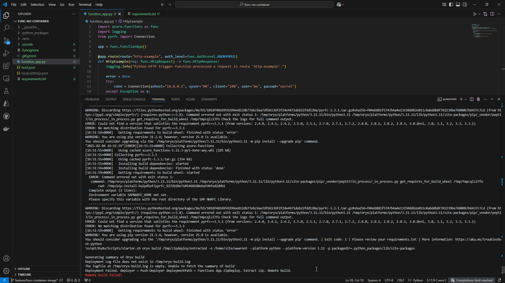

Ok. Now considering we have a function app with our image in a Dockerfile, let's deploy it to Azure.

## 1) Create your resources

Go to the Azure Portal and create a Function App. You may create a storage account separately, or let Azure handle it during the creation of the function app.

Make sure to select the option to deploy a container image, as shown in the image.
<br>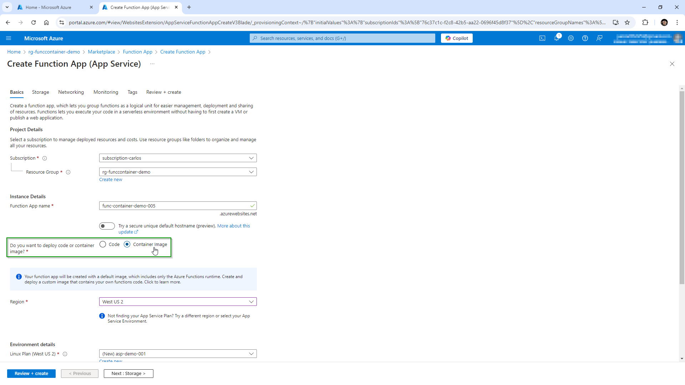

Now create a Container Registry. A basic plan is enough for this case.
<br>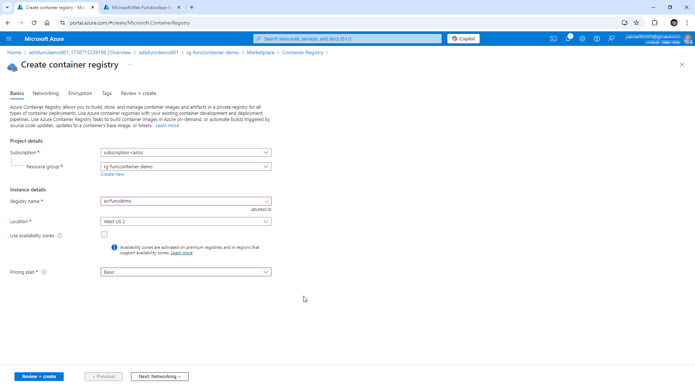

## 2) Build the container image and test locally

In the root project folder, run the docker build command.
> Note: make sure docker is running in your local. The following command builds the Docker image for the container.
```sh
docker build --tag <DOCKER_ID>/azurefunctionsimage:v1.0.0 .
```
<br>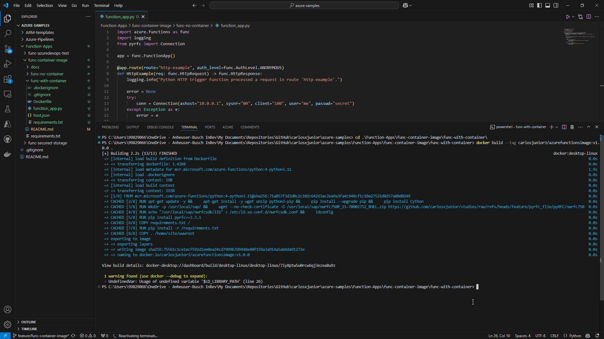

To test the build, run the image in a local container using the docker run command.
```sh
docker run -p 8080:80 -it <docker_id>/azurefunctionsimage:v1.0.0
```
You should see an output similar to this:
<br>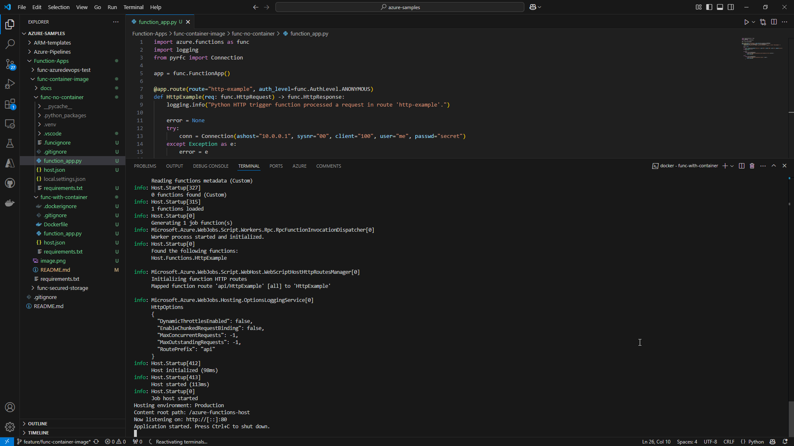

With the image running, browse to http://localhost:8080/api/call-pyrfc to trigger the function locally. The function will return an error because there is no real connection being tested, but pyrfc has been successfully setup.
<br>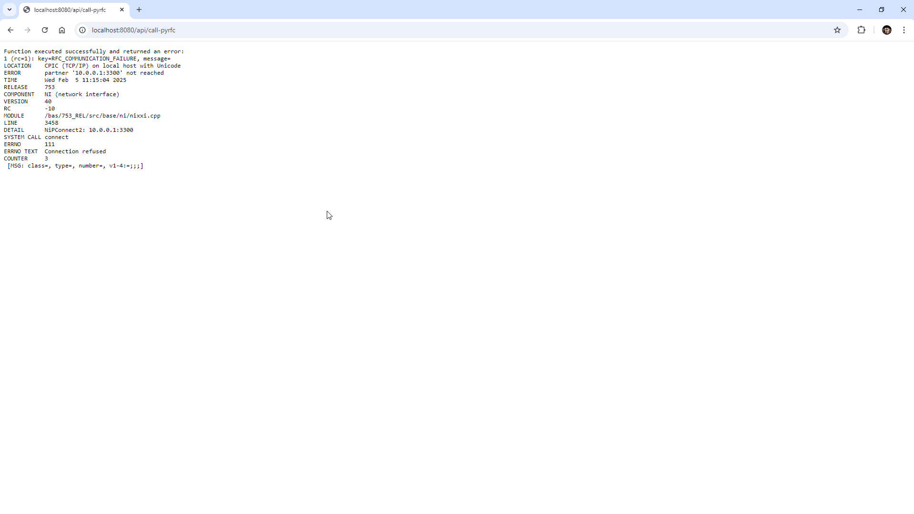

## 3) Publish the container image to a registry
To make your container image available for deployment to a hosting environment, you must push it to a container registry.<br>In this demo, Azure Container Registry is used, but you could opt for Docker Hub too.

Use the below command to sign in to your registry instance using your current Azure credentials. You may need to run `az login` before to log in to your account.
```Azure CLI
az acr login --name <REGISTRY_NAME>
```

Tag your image with the fully qualified name of your registry login server. Run the below command:
```docker
docker tag <DOCKER_ID>/azurefunctionsimage:v1.0.0 <LOGIN_SERVER>/azurefunctionsimage:v1.0.0
```

Replace <LOGIN_SERVER> with the fully qualified name of your registry login server and <DOCKER_ID> with your Docker ID. 

The login_server parameter can be found in Azure Portal, in your ACR instance.
<br>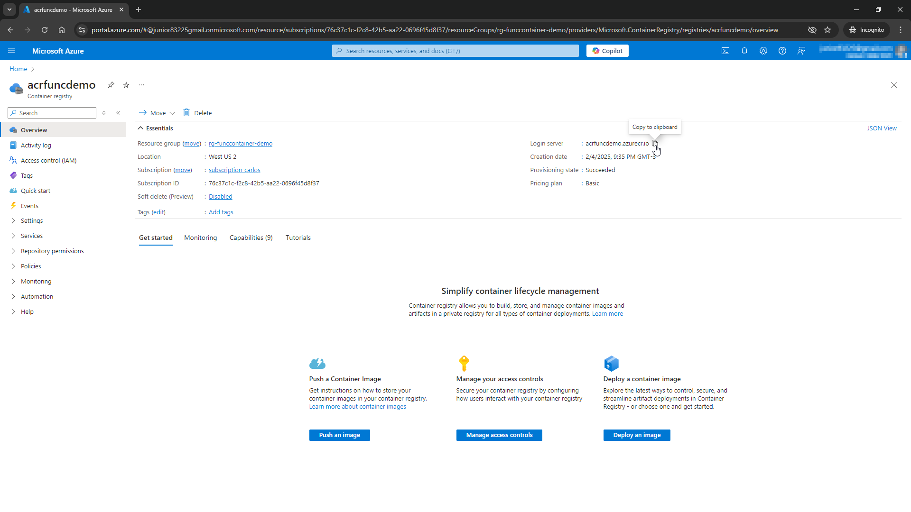

Now push the container to your registry instance by running the command:
```docker
docker push <LOGIN_SERVER>/azurefunctionsimage:v1.0.0
```

You should an output similar to this:
<br>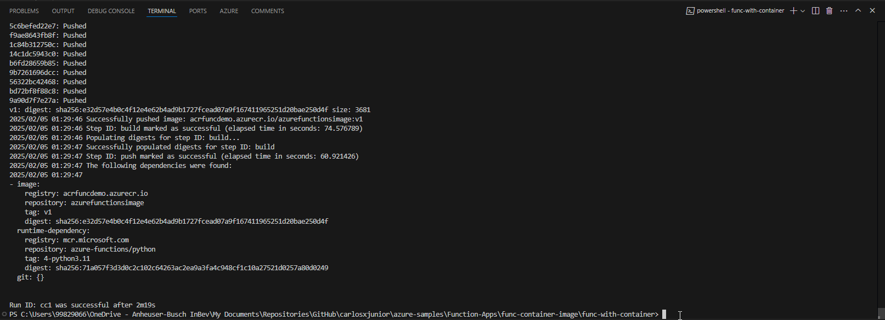

## 4) Deploy your image and validate

Go to your Function App in Azure Portal and select **Deployment center**, under the **Deployment** tab.
<br>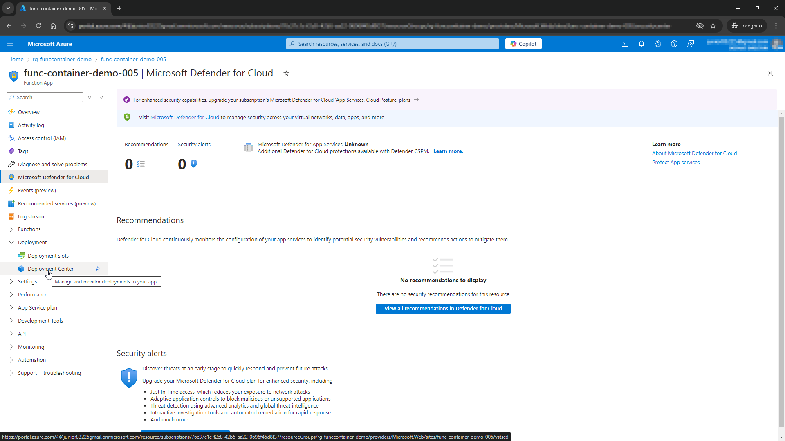

Configure your settings as follows:
<br>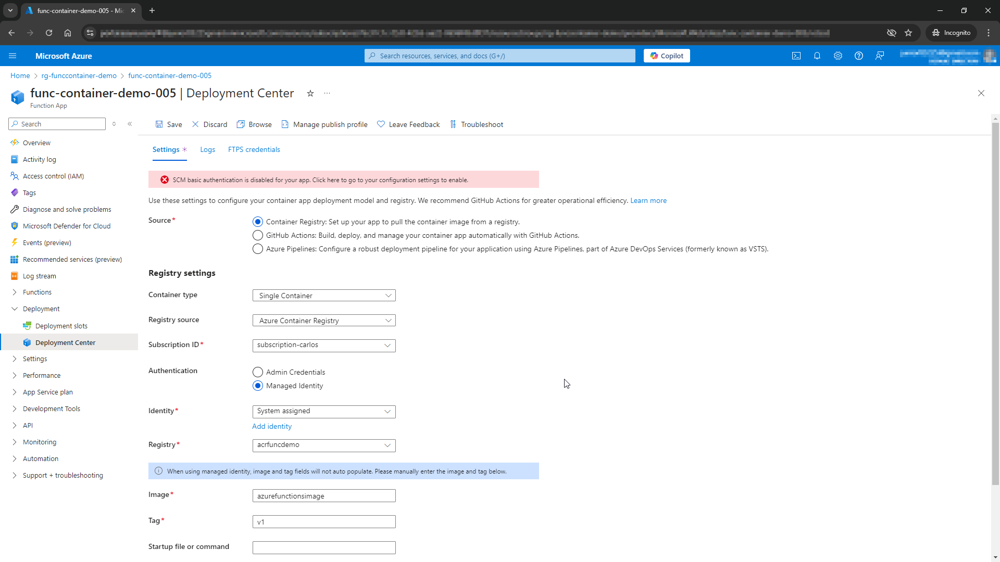

Now you have successfully deployed your container image to Azure Functions!

Please take some time and then verify that your functions appear under the **Overview** tab of your function app.
<br>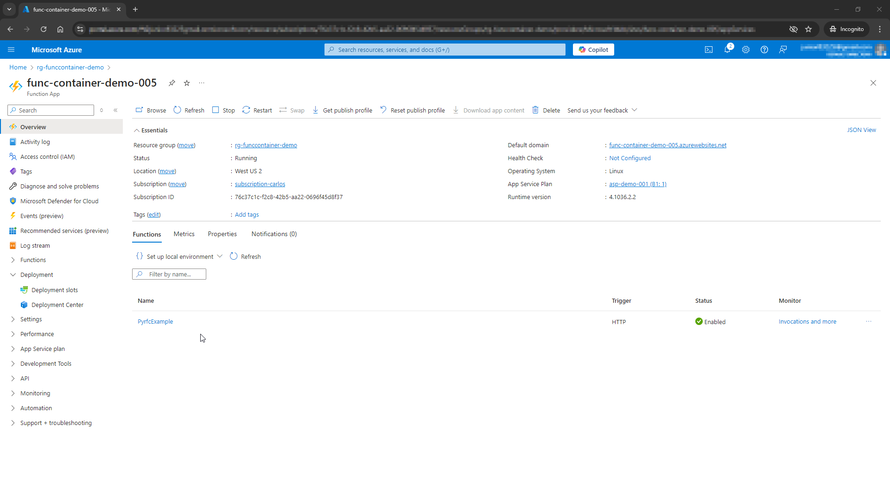

Click on the function name to open the below screen, then click on **Get Function URL** and copy the URL to trigger the function.
<br>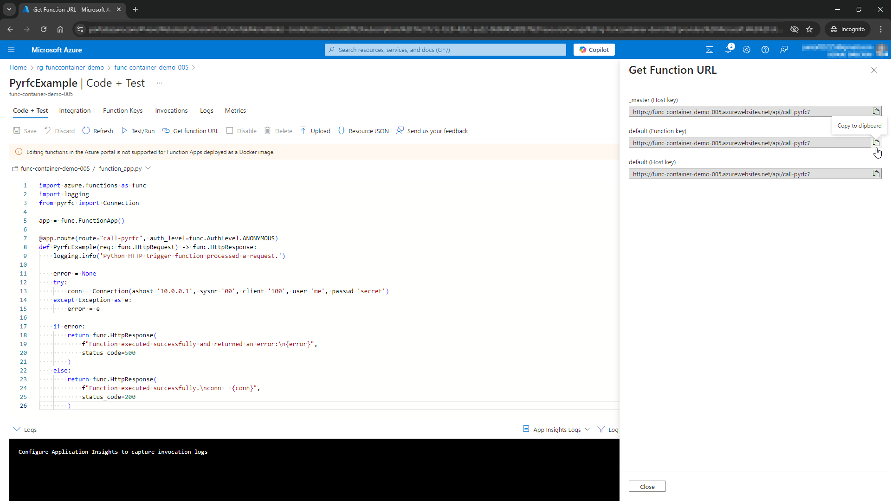

Open your browser and paste the URL to trigger it.
<br>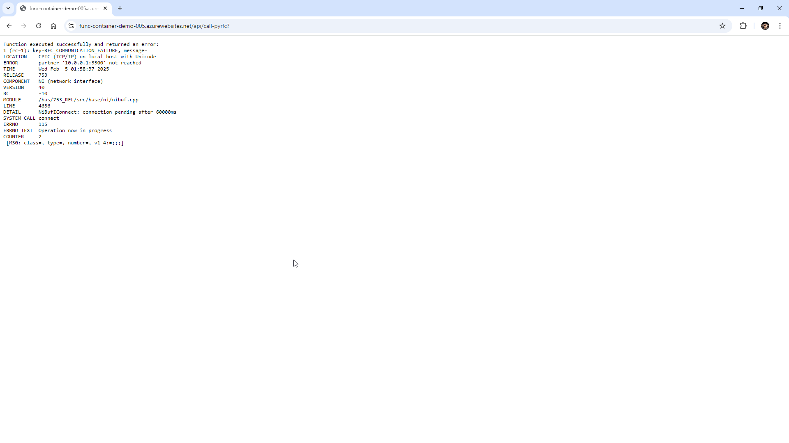

That is it! You have your containerized functions app and running.

