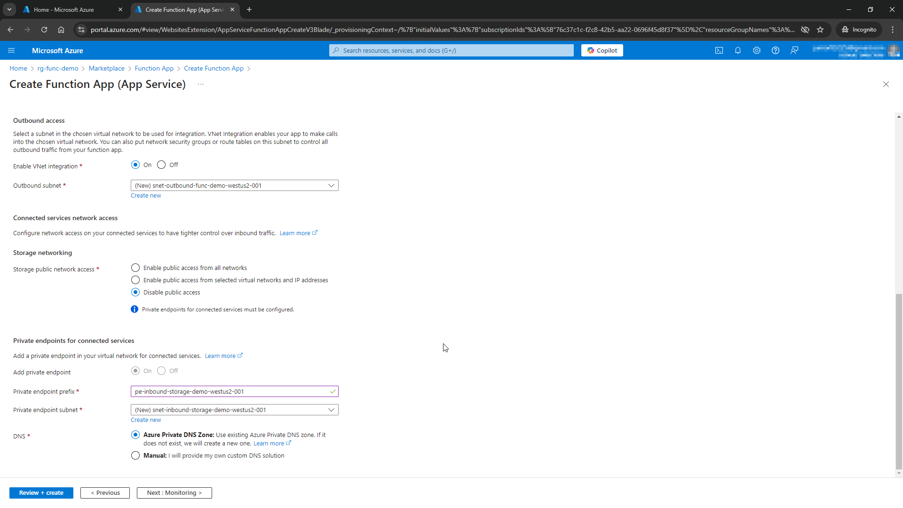
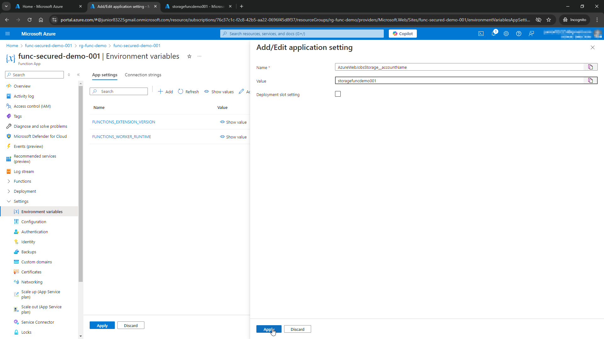

# Secure an Azure Function App with a virtual network and system managed identity

This tutorial shows how to secure Azure Functions by disabling public access and using a virtual network to connect with other resources. In this demo, the other resources are a secured storage account and a virtual machine, used to deploy code and test our functions.

It also explains how to connect your function app to a storage account with a managed identity instead of a connection string, to avoid accidental leak of sensitive secrets.

## TLDR
✅ Create secured Azure Function App and Storage Account<br>
🔒 Disable public access to resources<br>
🗝️ Use a system managed identity to connect the function app and the storage account<br>
🖥️ Use a VM inside your network to deploy code and test

## Resources deployed in this demo
- 1 Function App
- 1 App Service plan (optional)
- 1 Storage account
- 1 Virtual network
- 6 Network Interfaces
- 5 Private endpoints
- 5 Private DNS zones
- 1 Virtual machine
    - 1 Disk
    - 1 SSH key
    - 1 Network security group
    - 1 Public IP address

## Main references
- [Tutorial: Integrate Azure Functions with an Azure virtual network by using private endpoints](https://learn.microsoft.com/en-us/azure/azure-functions/functions-create-vnet)
- [Use managed identity instead of AzureWebJobsStorage to connect a function app to a storage account](https://techcommunity.microsoft.com/blog/appsonazureblog/use-managed-identity-instead-of-azurewebjobsstorage-to-connect-a-function-app-to/3657606)
- [Develop Azure Functions locally using Core Tools](https://learn.microsoft.com/en-us/azure/azure-functions/functions-run-local?tabs=linux%2Cisolated-process%2Cnode-v4%2Cpython-v2%2Chttp-trigger%2Ccontainer-apps&pivots=programming-language-python)
- [Install the Azure CLI on Linux](https://learn.microsoft.com/en-us/cli/azure/install-azure-cli-linux?pivots=apt)
- [POST JSON Data With Curl](https://www.warp.dev/terminus/post-json-data-with-curl?gad_source=1&gclid=CjwKCAiA74G9BhAEEiwA8kNfpcjAfUb-TqVN_IuZoC-g4XVfid3SMpDr3Vb_vShEEnFQDCTzH1BpOhoCN_wQAvD_BwE)

[GitHub repo with functions code](https://github.com/carlosxjunior/azure-samples/tree/main/Function-Apps/func-secured-storage)

## Let's get to work

### 1) Create a new resource group

Launch the Cloud Shell to use Azure CLI.
<br>

Run the command `az group create` to create a new RG. Specify the region and the RG name.<br>[Reference](https://learn.microsoft.com/pt-br/cli/azure/group?view=azure-cli-latest)
<br>

The output should look somewhat like this.
<br>

### 2) Create the Function App + Storage Account

To create the function app, I followed the step by step in this [guide](https://learn.microsoft.com/en-us/azure/azure-functions/functions-create-vnet#create-a-function-app-in-a-premium-plan).

Inside your new RG, click **Create**.
<br>

Search for function app and select it.
<br>

Click **Create** to create a new function app.
<br>

Select a hosting option. Here I'm using App Service, but other options will work too. Click **Select**.
<br>

In the create screen, make sure the right RG is selected. Enter the name of your function app, the runtime, the region (here using the same as the RG), and a name for your app service, as well as the pricing tier (applied if ASP was chosen as the hosting option).

<br>

Give the name for a new storage account to be created. You could also create it manually.
<br>

Configure the **Networking** options. Make sure to disable public access and enable virtual network configuration.<br>Then, create your networking resources: virtual network, subnets and private endpoints.
<br>

<br>

After **Networking**, you can skip the other settings and go straight to **Review + create**.
<br>

### 3) Setup your function app

Go back to your resource group and select your newly created function app.
<br>

Select **Identity**.
<br>

Click **On** to create a system managed identity. Then click on **Azure role assignments**.
<br>

Click on **Add role assignment (Preview)**.
<br>

Assign the role _Storage Blob Data Owner_ to your managed identity in the storage account connected to the function app. Then click on **Save**.
<br>

Repeat the same steps to also add the roles _Storage Account Contributor_ and _Storage Queue Data Owner_ to the managed identity.

Now go back to your storage account, select **Access Control (IAM)**, select **Check access**, seach for your system managed identity for the function app, and check that the correct roles have been assigned.
<br>

Now back to your function app, select **Environment variables**. These variables should pop up.
<br>

We want to delete the default variable `AzureWebJobsStorage`, that holds a connection string for our storage account, and replace it with the `AzureWebJobsStorage__accountName`, with the value as the name of the storage account.
<br>

Check that the new variable is correctly set. Do not forget to click **Apply**.
<br>

### 4) Create a virtual machine

In order to deploy functions to our function app, we will use a virtual machine inside our virtual network. We cannot deploy from our local machine, for example, as we disabled public access for this app.

Here, search and select Virtual machine.
<br>

Click on **Create**.
<br>

Configure the basic settings for the VM. Give it a name, select a region, an image and the size.<br>For this demo, I'm using a basic VM in the B1s family, with an Ubuntu image.
<br>

Define your disk settings. I have lowered down the configurations just to make it even cheaper for the demo.
<br>

Under **Networking**, make sure our virtual network from the function app is selected, otherwise we will not be able to deploy our code.
<br>

Skip the other settings and go to **Review + create**. Click **Create**.
<br>

Click the button to download a private key, used to SSH into this VM.
<br>

### 5) Setup virtual machine

Now that our virtual machine is up and running, we need to configure it so we can deploy code to our function app.

We start by getting the VM's public IP address.
<br>

Open a terminal and run the following command to SSH into the VM.
```Powershell
cd Downloads
ssh -i <vm_name>_key.pem azureuser@<vm_public_ip>
```
<br>

_Voilá_, we are now connected to our virtual machine.

Now we need to install both the **Azure Functions Core Tools** and the **Azure CLI** in our VM in order to deploy our functions.

For the **Azure Functions Core Tools**, I just followed the steps mentioned [here](https://learn.microsoft.com/en-us/azure/azure-functions/functions-run-local?tabs=linux%2Cisolated-process%2Cnode-v4%2Cpython-v2%2Chttp-trigger%2Ccontainer-apps&pivots=programming-language-python), which are to run the following commands:
```Bash
curl https://packages.microsoft.com/keys/microsoft.asc | gpg --dearmor > microsoft.gpg

sudo mv microsoft.gpg /etc/apt/trusted.gpg.d/microsoft.gpg

sudo sh -c 'echo "deb [arch=amd64] https://packages.microsoft.com/repos/microsoft-ubuntu-$(lsb_release -cs 2>/dev/null)-prod $(lsb_release -cs 2>/dev/null) main" > /etc/apt/sources.list.d/dotnetdev.list' # For Ubuntu

sudo apt-get update

sudo apt-get install azure-functions-core-tools-4
```
After that, we can check the installation by running `func -h`. Below is the output of this command.
<br>

Installing the **Azure CLI** is even simpler, as explained [here](https://learn.microsoft.com/en-us/cli/azure/install-azure-cli-linux?pivots=apt).

All we have to do is run the command:
```Bash
curl -sL https://aka.ms/InstallAzureCLIDeb | sudo bash
```

And then check the installation using `az -h`.
<br>

### 6) Deploy code to function app

Now that **Azure Function Core Tools** and the **Azure CLI** are ready, we can finally deploy some functions to our function app.

The code I used for this demo can be found [here](https://github.com/carlosxjunior/azure-samples/tree/main/Function-Apps/func-secured-storage), in my personal repository in GitHub.


Run `az login` to log in to your Azure account. Follow the instructions in the screen.
<br>

After opening the link in the browser, using the code and selecting your account, this screen will pop up. You can close your browser and return to the VM.
<br>

A similar screen should appear. Select your subscription or press Enter for no changes.
<br>

Now, use `git clone` to import the code to our VM.
```Bash
git clone https://github.com/carlosxjunior/azure-samples.git
```
<br>

With the code in our hands, we can deploy it to our function app in Azure. To do so, cd into the directory containing the code and from there, deploy using the **Azure Function Core Tools**, using the command:
```Shell
func azure functionapp publish <function-app-name> --python
```
<br>

You should see an output similar to this for a successful deployment. _Remote build succeeded!_
<br>

_Yes!_ Back in Azure Portal, we confirm that our 3 functions have been deployed.
<br>

Let's test them!

### 7) Run your functions

Click in the function name and then click on **Get Function URL**. Copy the URL with the Function key (this setting can be modified in the function code if you don't want to authorize with a key in the request).
<br>

Run a POST request from the VM and... it works!
<br>

Now copy the URL into your browser and try to run it from there. It should not work, as we are not allowing public access to this function app.
<br>

We now repeat the process for the other 2 functions.
<br>

But first, let's create a container in our storage account to test our functions.
Here the raw container is created.
<br>

Function UploadBlob works too!
<br>

Now get the URL for function ReadBlob.
<br>

Awesome, we can read the blob we just created from our other function!
<br>

We cannot access the blob using the Portal, as only access through the virtual network is allowed.
<br>

Once again, we cannot call the function from our machine, as we have successfully secured our function app and storage account.
<br>

## Conclusion
In this tutorial, we have successfully secured an Azure Function App by disabling public access and using a virtual network to connect with other resources. We created a secured storage account and a virtual machine for deploying code and testing our functions. Additionally, we connected the function app to the storage account using a system managed identity, eliminating the need for connection strings and reducing the risk of accidental secret leaks. This setup ensures a more secure and robust environment for your Azure Functions.
